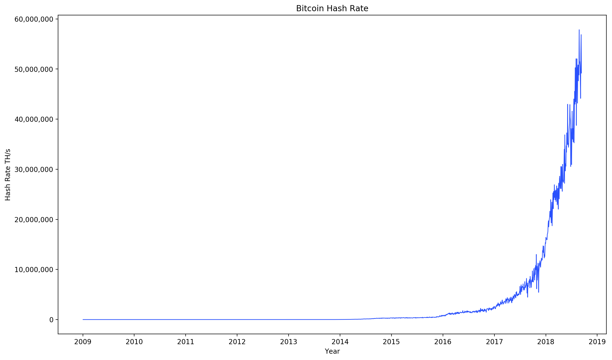
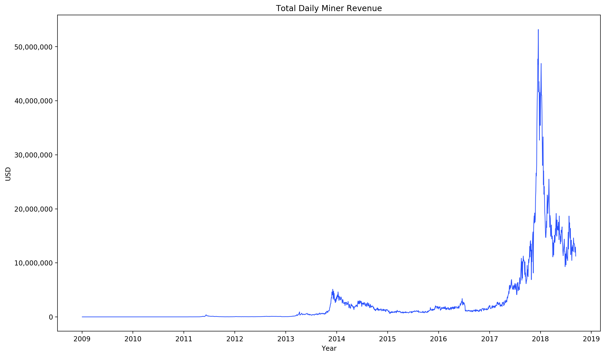
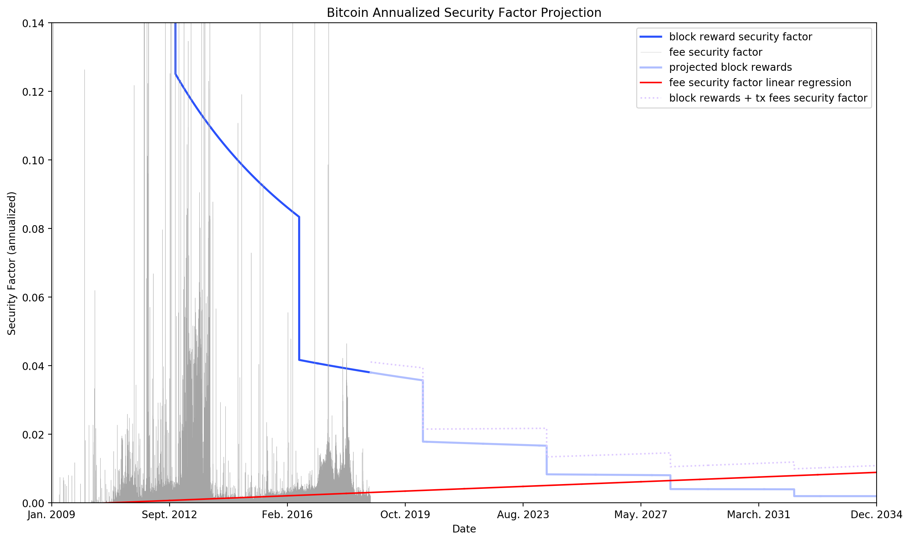

# BTC Security Factor

Plots Bitcoin hash rate, miner revenue, and "security factor".
The security factor is also extrapolated out to get an estimate of Bitcoin's relative security in the future.

## Security Budget
The security of PoW cryptocurrencies like Bitcoin is proportional to miner revenue.
Miner revenue can then be referred to as the "security budget".

## Security Factor
Cost to attack must also scale with network value, so cryptonetworks must maintain a high security factor -- cost to attack as percentage of market cap.

## Usage
Run one of `hash_rate.py`, `miner_revenue.py` or `security_factor.py` to produce the respective chart.

`security_factor.py` pulls data from every single Bitcoin block so it will take a while.
Each time the script is run it will check for new blocks and auto-download them.

See my [Medium post](https://medium.com/coinmonks/bitcoin-security-a-negative-exponential-95e78b6b575) for more details.
