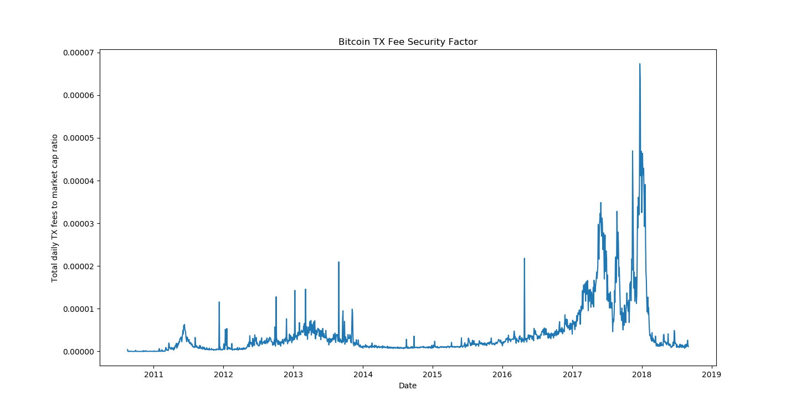
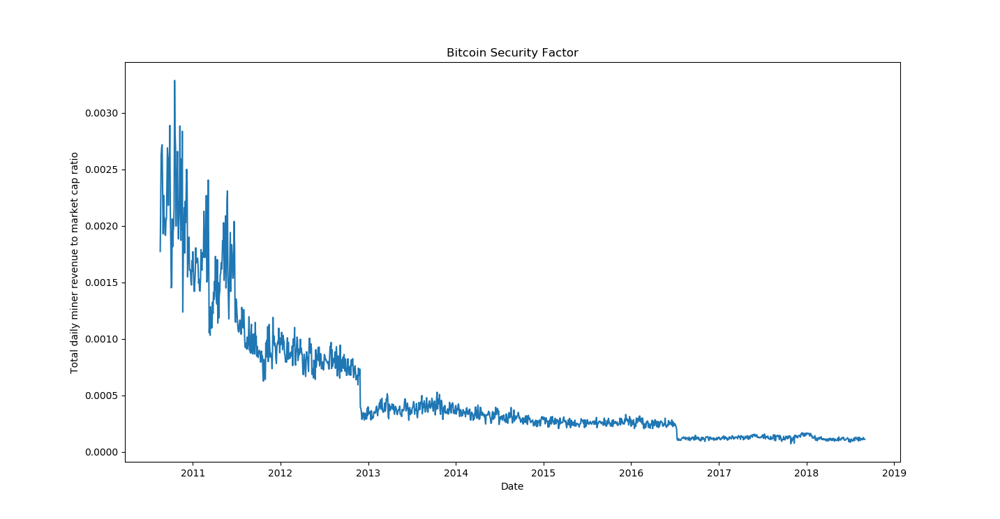

# BTC Security Factor

Plots Bitcoin daily "security factor" since genesis.

## Security Budget
The security of PoW cryptocurrencies like Bitcoin is proportional to miner revenue.
Miner revenue can then be referred to as the "security budget".

## Security Factor
Cost to attack must also scale with network value, so cryptonetworks must maintain a high security factor -- cost to attack as percentage of market cap.

## Declining Block Rewards
As block rewards decline, transaction fees become the sole source of Bitcoin security budget.

Some Bitcoin proponents argue that total tx fees paid will increase **relative** to network value as block rewards decline.

The data appears to refute this claim, indicating a relatively constant baseline for this "tx-fee only" security factor.

See my [Medium post](https://medium.com/coinmonks/bitcoin-security-a-negative-exponential-95e78b6b575) for more details.
